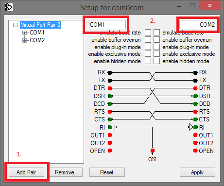
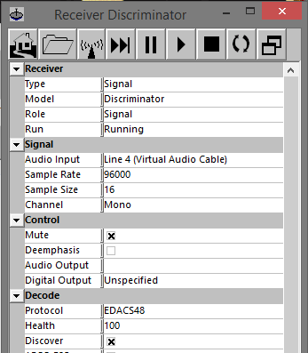
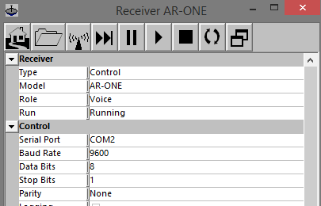
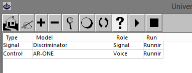
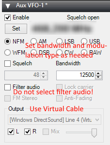
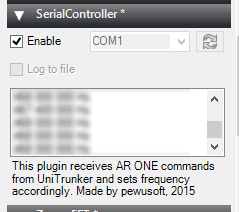

howto - trunking radio with one SDR
===================================

If all frequencies of your trunked radio network fit inside the bandwidth of your receiver (that was my case), you can follow through this tutorial to listen trunked radio using only one SDR receiver. You'll need:

*   [SDR#](http://sdrsharp.com/)
*   [Unitrunker](http://unitrunker.com/)
*   [AuxVFO](http://www.rtl-sdr.ru/page/obnovlen-plagin-dopolnitelnogo-radiokanala-aux-fvo-1) (russian, but Google Translate works)
*   [my plugin for SDR# - SerialController](https://github.com/walczakp/serial-controller)
*   [Virtual Audio Cable](http://software.muzychenko.net/eng/) (trial is sufficient)
*   [com0com](http://com0com.sourceforge.net/) ([version that works on Win 8.1 x64](com0com.7z), no need to install, just run setupg.exe)

1\. install everything
----------------------

That's simple. You'll need to have SDR# with plugins, Unitrunker, com0com and VAC installed and running.

2\. configure VAC
-----------------

Enter VAC control panel, add one cable and set SR range to 96000..96000. There is no need to set as much as on screenshot. Just one cable is sufficient.

3\. configure com0com
---------------------

In setupg.exe add new pair and configure as follows:

4\. configure Unitrunker
------------------------

Add "signal" receiver (which receives control channel). Set your newly created Virtual Cable as input, with settings as shown on screenshot:

Add another receiver, this time choosing "control". This receiver will be connected to SDR# for frequency changing. Model should be set as AR-ONE, role as Voice and serial port like this (one end of com0com pair):

Click Play in both receivers to start them.

5\. configure SDR#
------------------

Make sure AuxVFO and SerialController plugins are installed. Enable radio on SDR#. Set your frequency, so that each trunking channel is visible (this will ensure that while switching frequencies, you don't lose your control channel). After that, tune to control channel frequency and go to AuxVFO plugin settings. Click Set to lock AuxVFO on current freq. Set AuxVFO settings as on screenshot (as audio device use your virtual cable) and after you click Enable, Unitrunker should catch the signal and regonize the system of your trunked radio.

Skip to SerialController settings, select COM port to other end of com0com pair and click enable.

6\. you're good to go!
----------------------

Assuming your site appeared on Unitrunker and you set frequencies for all channels, everything should be working by now. Unitrunker should correctly switch SDR# frequency between currently used frequencies on trunked radio that you want listen to.

